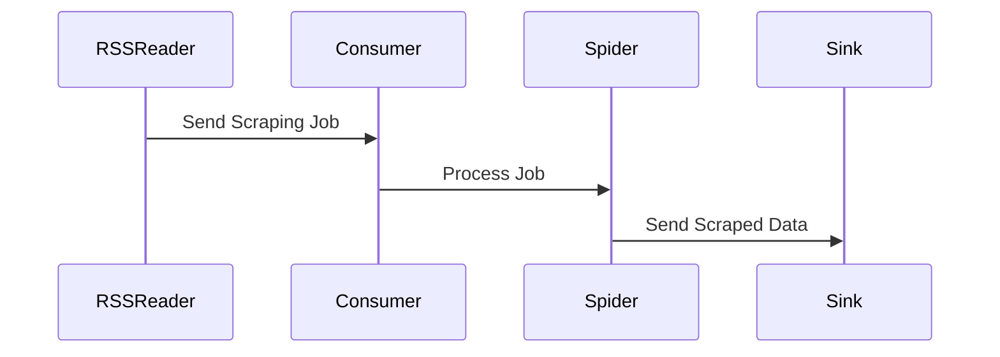
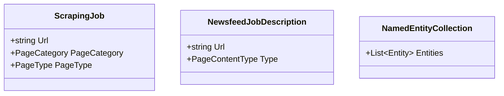

# 📖 Project Architecture Documentation

## 1️⃣ Project Overview

**Description:**
AgitpropScraper is a comprehensive web scraping and data processing system designed to automate the collection, processing, and analysis of web content, particularly news articles. It integrates with various services to extract structured data and insights from unstructured web pages.

**Main Goals and Use-Cases:**
- Automate the collection of news articles from multiple sources.
- Process and analyze content using Natural Language Processing (NLP).
- Store and manage structured data for downstream applications.
- Provide a modular and extensible architecture for future enhancements.

---

## 2️⃣ Main Components and Modules

### **Agitprop.AppHost**
- **Purpose:** Entry point for the application, orchestrates services and dependencies.
- **Responsibilities:**
  - Configures RabbitMQ messaging.
  - Manages service dependencies like SurrealDB and NLP services.

### **Agitprop.Consumer**
- **Purpose:** Processes scraping jobs and sends data to sinks.
- **Responsibilities:**
  - Implements MassTransit for message-based communication.
  - Handles resiliency and error handling.

### **Agitprop.Core**
- **Purpose:** Core abstractions and shared models.
- **Responsibilities:**
  - Defines scraping job descriptions and enums.
  - Provides interfaces for modularity.

### **Agitprop.Infrastructure**
- **Purpose:** Implements core infrastructure like HTTP clients and spiders.
- **Responsibilities:**
  - Provides `Spider` for web crawling.
  - Implements proxy-based HTTP clients.

### **Agitprop.Infrastructure.Puppeteer**
- **Purpose:** Adds Puppeteer-based browser automation.
- **Responsibilities:**
  - Supports headless browser scraping.
  - Configures Puppeteer with optional proxy support.

### **Agitprop.NLPService**
- **Purpose:** Provides NLP capabilities for text analysis.
- **Responsibilities:**
  - Extracts named entities and other insights from text.

### **Agitprop.RssFeedReader**
- **Purpose:** Reads and processes RSS feeds.
- **Responsibilities:**
  - Fetches and parses RSS feeds.
  - Sends scraping jobs to the consumer.

### **Agitprop.Scraper.Sinks.Newsfeed**
- **Purpose:** Processes and stores scraped data.
- **Responsibilities:**
  - Implements SurrealDB for data storage.
  - Provides paginators and parsers for specific websites.

### **Agitprop.ServiceDefaults**
- **Purpose:** Shared service configurations.
- **Responsibilities:**
  - Configures OpenTelemetry, health checks, and resilience.

### **Agitprop.ConsoleToolKit**
- **Purpose:** Provides command-line tools for manual operations.
- **Responsibilities:**
  - Implements commands for queue management and scraping retries.

---

## 3️⃣ Technology Stack

- **Languages:** C#, Python
- **Frameworks:** .NET 8.0, Puppeteer
- **Libraries:** MassTransit, SurrealDB.Net, OpenTelemetry
- **Databases:** SurrealDB
- **Tools:** Docker, RabbitMQ, Matomo

---

## 4️⃣ Processes and Workflows

### **Initialization and Startup**
- `Agitprop.AppHost` initializes services and dependencies.
- RabbitMQ and SurrealDB are configured and started.

### **Data Flow**
1. RSS feeds are read by `Agitprop.RssFeedReader`.
2. Scraping jobs are sent to `Agitprop.Consumer` via RabbitMQ.
3. `Agitprop.Consumer` processes jobs using `Spider`.
4. Scraped data is sent to `Agitprop.Scraper.Sinks.Newsfeed` for storage.

### **UML Sequence Diagram**

---

## 5️⃣ Data Models

### **Key Entities**
- **ScrapingJob:** Represents a web scraping task.
- **NewsfeedJobDescription:** Describes a newsfeed scraping job.
- **NamedEntityCollection:** Stores extracted entities.

### **UML Class Diagram**

---

## 6️⃣ Configuration and Environment

### **Configuration Files**
- `appsettings.json`: General application settings.
- `appsettings.Development.json`: Development-specific settings.

### **Environment Variables**
- `SURREAL_PASS`: Password for SurrealDB.
- `DOTNET_ENVIRONMENT`: Specifies the environment (e.g., Development).

---

## 7️⃣ Build and Deployment

### **Build Process**
- Use `dotnet build` to compile the project.

### **Deployment**
- Docker is used for containerized deployment.
- Services are orchestrated using `docker-compose`.

---

## 8️⃣ Development Guidelines

- **Code Style:** Follow .NET naming conventions.
- **Patterns:** Dependency Injection, Resilience Pipelines.
- **Testing:** Unit tests are located in `*_Test` projects.

---

## 9️⃣ Deprecated or Unused Components

- **Agitprop.ConsoleToolKit:** Contains legacy commands for scraping.

---

## 🔟 Future Features and Planned Enhancements

### **Feature: Enhanced NLP Analysis**
- **Description:** Add sentiment analysis and topic modeling capabilities.
- **Affected Modules:** `Agitprop.NLPService`
- **Data Model Changes:** Extend `NamedEntityCollection` to include sentiment scores.
- **Workflow:**
  1. Scraped data is sent to `Agitprop.NLPService`.
  2. Sentiment and topics are extracted and stored in SurrealDB.

### **Feature: Real-Time Monitoring Dashboard**
- **Description:** Provide a web-based dashboard for monitoring scraping jobs.
- **Affected Modules:** `Agitprop.AppHost`, `Agitprop.Consumer`
- **Data Model Changes:** Add real-time job status tracking.
- **Workflow:**
  1. Job status updates are sent to a WebSocket server.
  2. Dashboard displays real-time updates.

---